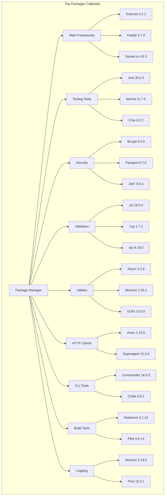

# Top Packages

A curated collection of the most popular and widely-used npm packages for Node.js development. This project serves as a reference guide and starter template featuring 98 essential packages spanning web frameworks, testing tools, security utilities, validation libraries, and more.

Built in 2024-2025. This collection provides developers with a comprehensive overview of battle-tested npm packages with compatible versions.

## Features

- 🚀 Popular web frameworks (Express, Fastify)
- ✅ Complete testing ecosystem (Jest, Mocha, Chai, Sinon)
- 🔒 Security utilities (bcrypt, passport, JWT)
- ✔️ Validation libraries (Joi, Yup, Ajv)
- 🛠️ Essential utilities (async, moment, uuid)
- 📡 HTTP clients (Axios, Superagent)
- 🎨 CLI tools (Commander, Chalk)
- 📦 Build tools (Nodemon, PM2, Grunt)
- 📊 Logging frameworks (Winston, Pino, Morgan)
- 🗄️ Database tools (Mongoose)

## Architecture



## Getting Started

### Prerequisites

- Node.js (v16 or higher recommended)
- npm or pnpm package manager

### Installation

1. Clone the repository:
```bash
git clone https://github.com/orassayag/top-packages.git
cd top-packages
```

2. Install dependencies:
```bash
npm install
```
Or using pnpm:
```bash
pnpm install
```

### Usage

#### As a Reference

Browse `package.json` to explore popular packages and their versions. Each package is carefully selected for:
- High community adoption
- Active maintenance
- Production-ready stability
- Comprehensive documentation

#### As a Starter Template

Copy the packages you need for your project:
```bash
# Install specific packages
npm install express joi bcrypt winston
```

#### Exploring Packages

View package details:
```bash
npm info express
npm info axios
npm show joi
```

## Package Categories

### 🚀 Web Frameworks
- **Express** (5.2.1) - Fast, unopinionated web framework for Node.js
- **Fastify** (5.7.4) - High-performance web framework with low overhead
- **Socket.io** (4.8.3) - Real-time bidirectional event-based communication

### ✅ Testing Ecosystem
- **Jest** (30.2.0) - Delightful JavaScript testing framework
- **Mocha** (11.7.5) - Feature-rich JavaScript test framework
- **Chai** (6.2.2) - BDD/TDD assertion library
- **Sinon** (21.0.1) - Test spies, stubs, and mocks
- **Supertest** (7.2.2) - HTTP assertions made easy
- **Karma** (6.4.4) - Test runner for multiple browsers

### 🔒 Security & Authentication
- **Bcrypt** (6.0.0) - Industry-standard password hashing
- **Passport** (0.7.0) - Simple, unobtrusive authentication
- **Passport-jwt** (4.0.1) - JWT authentication strategy
- **Jsonwebtoken** (9.0.3) - JWT implementation
- **Express-jwt** (8.5.1) - JWT middleware for Express

### ✔️ Validation Libraries
- **Joi** (18.0.2) - Powerful schema description and validation
- **Yup** (1.7.1) - Dead simple object schema validation
- **Ajv** (8.18.0) - The fastest JSON Schema validator
- **Validator** (13.15.26) - String validation and sanitization

### 🛠️ Utility Libraries
- **Underscore** (1.13.8) - Functional programming helpers
- **Async** (3.2.6) - Async utilities for node and browser
- **Bluebird** (3.7.2) - Full-featured Promise library
- **Moment** (2.30.1) - Parse, validate, and manipulate dates
- **UUID** (13.0.0) - Generate RFC-compliant UUIDs
- **Nanoid** (5.1.6) - Tiny, secure URL-friendly unique ID generator

### 📡 HTTP Clients
- **Axios** (1.13.6) - Promise-based HTTP client
- **Superagent** (10.3.0) - Small progressive HTTP request library
- **Centra** (2.7.0) - Lightweight HTTP client

### 🎨 CLI Tools
- **Commander** (14.0.3) - Complete solution for node.js command-line programs
- **Chalk** (5.6.2) - Terminal string styling done right

### 📦 Build & Development Tools
- **Nodemon** (3.1.14) - Monitor for changes and auto-restart
- **PM2** (6.0.14) - Production process manager
- **Cross-env** (10.1.0) - Run scripts with cross-platform environment variables
- **Grunt** (1.6.1) - JavaScript task runner
- **Rimraf** (6.1.3) - Deep deletion (rm -rf) utility
- **ESLint** (10.0.2) - Pluggable JavaScript linter

### 📊 Logging Frameworks
- **Winston** (3.19.0) - Multi-transport async logging library
- **Morgan** (1.10.1) - HTTP request logger middleware
- **Pino** (10.3.1) - Super fast, all-natural JSON logger

### 🗄️ Database Tools
- **Mongoose** (9.2.3) - MongoDB object modeling for Node.js

### 📄 File System & Parsing
- **Fs-extra** (11.3.4) - Extra file system methods
- **Cheerio** (1.2.0) - Fast, flexible HTML parsing
- **Dotenv** (17.3.1) - Load environment variables from .env

### 🎨 Miscellaneous
- **Color** (5.0.3) - JavaScript color conversion and manipulation
- **Slugify** (1.6.6) - Slugifies a string
- **Cors** (2.8.6) - Connect/Express middleware for CORS
- **Pug** (3.0.3) - High-performance template engine
- **Cloudinary** (2.9.0) - Cloudinary image and video management

## Development

### Checking for Updates
```bash
npm outdated
```

### Updating Packages
```bash
npm update
# or
pnpm update
```

### Security Audits
```bash
npm audit
npm audit fix
# or
pnpm audit
pnpm audit fix
```

## Project Structure

```
top-packages/
├── node_modules/       # Installed packages
├── package.json        # Package definitions and versions
├── package-lock.json   # Locked versions for consistency
├── index.js           # Entry point (test file)
├── README.md          # This file
├── CONTRIBUTING.md    # Contribution guidelines
├── INSTRUCTIONS.md    # Detailed usage instructions
└── LICENSE            # MIT License
```

## Package Selection Criteria

All packages in this collection meet these standards:

1. ✅ **High popularity** - Millions of downloads per week
2. ✅ **Active maintenance** - Regular updates and releases
3. ✅ **Production ready** - Stable API and semantic versioning
4. ✅ **Well documented** - Comprehensive docs and examples
5. ✅ **Security focused** - Active vulnerability monitoring
6. ✅ **Community trusted** - Widely adopted in production apps

## Use Cases

1. **Reference Guide**: Quick lookup for popular package versions
2. **Project Template**: Bootstrap new projects with proven dependencies
3. **Learning Resource**: Explore ecosystem of widely-used tools
4. **Version Compatibility**: Test compatible versions together
5. **Training**: Introduce developers to essential npm packages

## Contributing

Contributions to this project are [released](https://help.github.com/articles/github-terms-of-service/#6-contributions-under-repository-license) to the public under the [project's open source license](LICENSE).

Everyone is welcome to contribute. Contributing doesn't just mean submitting pull requests—there are many different ways to get involved, including answering questions and reporting issues.

Please feel free to contact me with any question, comment, pull-request, issue, or any other thing you have in mind.

## Author

* **Or Assayag** - *Initial work* - [orassayag](https://github.com/orassayag)
* Or Assayag <orassayag@gmail.com>
* GitHub: https://github.com/orassayag
* StackOverflow: https://stackoverflow.com/users/4442606/or-assayag?tab=profile
* LinkedIn: https://linkedin.com/in/orassayag

## License

This application has an MIT license - see the [LICENSE](LICENSE) file for details.
